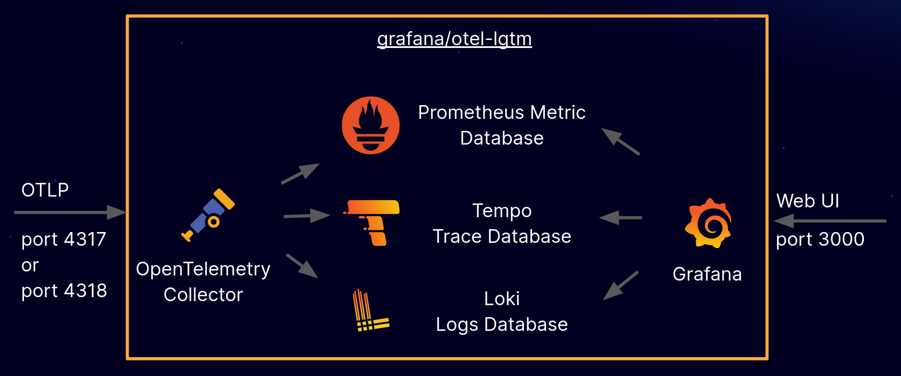

#Étapes détaillées pour le déploiement d'une application Lutece sur Kubernetes

Ce guide fournit des instructions pour déployer une application Lutece sur Kubernetes avec un runtime Open Liberty et une base de données Mariadb, incluant l'observabilité via la suite Grafana OTel LGTM.

# Table des matières
- [Guide de Déploiement de Lutece sur Kubernetes](#guide-de-déploiement-de-lutece-sur-kubernetes)
  - [Objectifs](#objectifs)
  - [Prérequis](#prérequis)
  - [Commencer](#commencer)

- [1. Conteneurisation une application lutece](#1-conteneurisation-une-application-lutece)
  - [1.1. Empaqueter l'application lutece](#11-empaqueter-lapplication-lutece)
  - [1.2. Créer votre image Docker](#12-créer-votre-image-docker-image-lutece)

- [2. Déploiement de Lutece sur Kubernetes](#2-déploiement-de-lutece-sur-kubernetes)
  - [2.1. Ressources de déploiement](#21-ressources-de-déploiement)
    - [2.1.1. Secret : db-credentials](#211-secret--db-credentials)
    - [2.1.2. ConfigMap : lutece-config](#212-configmap--lutece-config)
    - [2.1.3. Deployment : lutece-deployment](#213-deployment--lutece-deployment)
    - [2.1.4. Service : lutece-service](#214-service--lutece-service)
  - [2.2. Profils de Configuration](#22-profils-de-configuration)
    - [2.2.1. Utilisation des Profils de Configuration](#221-utilisation-des-profils-de-configuration)
    - [2.2.2. Format des Propriétés de Configuration par Profil](#222-format-des-propriétés-de-configuration-par-profil)
  - [2.3. Comment appliquer le déploiement](#23-comment-appliquer-le-déploiement)
  - [🌐 Accès à l'application Lutece](#-accès-à-lapplication-lutece)

- [3. docker-otel-lg](#3-docker-otel-lg)
  - [Documentation](#documentation)
  - [Récupérer l'image Docker](#récupérer-limage-docker)
  - [Exécuter l'image Docker](#exécuter-limage-docker)
    - [Configuration](#configuration)
      - [Activer la journalisation](#activer-la-journalisation)
  - [Exécuter lgtm dans Kubernetes](#exécuter-lgtm-dans-kubernetes)
  - [Envoyer des données OpenTelemetry](#envoyer-des-données-opentelemetry)
  - [Afficher Grafana](#afficher-grafana)
  - [Travaux Liés](#travaux-liés)

- [4. Déploiement de MariaDB sur Kubernetes avec Scripts d'Initialisation](#4-déploiement-de-mariadb-sur-kubernetes-avec-scripts-dinitialisation)
  - [Structure des Fichiers](#structure-des-fichiers)
  - [Configuration et Déploiement](#configuration-et-déploiement)
  - [Manifeste Kubernetes](#manifeste-kubernetes)
  - [Accès à MariaDB](#accès-à-mariadb)

- [5. Déploiement de l'application sur Kubernetes avec Open Liberty Operator](#5-déploiement-de-lapplication-sur-kubernetes-avec-open-liberty-operator)
  - [Installation de l'Opérateur](#installation-de-lopérateur)
  - [Déploiement](#déploiement)
  - [🌐 Accès à l'application Lutece](#-accès-à-lapplication-lutece-1)

- [6. Démontage de l'environnement](#6-démontage-de-lenvironnement)

- [📚 Documentation additionnelle](#-documentation-additionnelle)


# Guide de Déploiement de Lutece sur Kubernetes

## Objectifs
Ce guide vous aidera à :
- Exécuter une application Lutece sur le runtime Open Liberty.
- Construire l’image Docker de l’application en utilisant les images de conteneur Liberty.
- Déployer l’application conteneurisée sur un cluster Kubernetes (minikube) avec des manifestes Kubernetes.
- Déployer une instance MariaDB 10.5 sur Kubernetes avec initialisation d'une base de données pour l'application Lutece.
- Configurer l’observabilité pour Lutece avec la suite Grafana OTel LGTM.
- Déployer l’application conteneurisée sur un cluster Kubernetes (minikube) en utilisant l’Opérateur openLiberty.

---

## Prérequis

1. Installez Java 17 ou une version ultérieure.
2. Installez Maven 3.6.0 ou plus.
3. Vérifiez que Git est installé.
4. Installez Docker ([documentation Docker](https://docs.docker.com/install/)).
5. Installez Minikube pour un cluster Kubernetes à nœud unique ([documentation Minikube](https://github.com/kubernetes/minikube#installation)).
6. Assurez-vous que `kubectl` est installé ([instructions kubectl](https://kubernetes.io/docs/tasks/tools/install-kubectl/#install-kubectl-on-linux)).

---

## Commencer

Clonez le dépôt Git et accédez au projet :

```sh
git clone https://github.com/lutece-platform/guide-kubernetes-lutece.git
cd guide-kubernetes-lutece
```
# 1. Conteneurisation une application lutece
Cette section explique comment builder une image Lutece avec un image de base Open Liberty en utilisant Docker.

Si vous préférez ne pas suivre cette étape, vous pouvez passer directement au chapitre [2. Déploiement de Lutece sur Kubernetes](#2-deploiement-de-lutece-sur-kubernetes), car l'image Docker de Lutece pour ce projet est déjà disponible sur Docker Hub.

**Image lutece**

```sh
docker pull rafikyahiaoui/lutece-site-8:1.0.0-SNAPSHOT
```

## 1.1. Empaqueter l'application lutece 
Lutece nécessite une base de données pour fonctionner. Avant de lancer l'application, il est donc indispensable d'installer un serveur de base de données, puis de créer la base en utilisant les scripts disponibles dans le répertoire src/sql

Pour tester le site lutece (guide-kubernetes-lutece) à l'aide de Maven, exécutez le goal Maven suivant pour créer le site lutece et l'exécuter dans Open Liberty 
```sh
mvn liberty:run
```
Pour consulter la liste complète des goals disponibles, veuillez consulter ce [lien](https://github.com/OpenLiberty/ci.maven)

```sh
# lancer lutece en mode developpement
mvn liberty:dev    

# lancer lutece en mode developpement sur un conteneur
mvn liberty:devc   
```

Une fois que vous voyez le message suivant sur la ligne de commande, l'application lutece est prête 

	The luteceServer server is ready to run a smarter planet

Pour accéder à l'application lutece

	http://localhost:9090/lutece .
Une fois que vous avez terminé de vérifier l'application lutece, arrêtez l' instance Liberty en appuyant CTRL+C sur la session de ligne de commande dans laquelle vous avez exécuté le service lutece. Vous pouvez également exécuter l' liberty:stop objectif dans une autre session de ligne de commande 

	mvn  liberty:stop
Pour créer le war de votre application lutece, exécutez le goal lutece:war pour créer le .war dans le repertoire target

	mvn clean lutece:war

## 1.2.	Créer votre image Docker (image lutece)
Dans ce guide, vous utilisez une image officielle d'IBM Container Registry (ICR), icr.io/appcafe/open-liberty:kernel-slim-java17-openj9-ubi, comme image parent. Cette image est étiquetée avec le mot slim, ce qui signifie que cette image installe l'environnement d'exécution de base de Liberty pour minimiser l'empreinte de votre image en productio

```sh
#créer le war de votre application lutece,
mvn clean lutece:war     

#Créer l'image
docker build -t lutece-site-8:1.0.0-SNAPSHOT 
```

Pour vérifier que l'image est créée, exécutez la docker images commande pour répertorier toutes les images Docker locale
```sh
docker images
```	
# 2. Deploiement de Lutece sur Kubernetes

Ce chapitre fournit des informations pour déployer l'application Lutece sur Kubernetes en utilisant plusieurs ressources Kubernetes, notamment les Secrets, ConfigMaps, Deployments et Service.
## 2.1.	Ressources de déploiement
Le fichier de description des resources kubernetes pour l'application lutece est:

deploy/k8s/lutece.yaml

Ci-dessous la descrition du fichier

### 2.1.1. Secret : `db-credentials`

Ce Secret stocke des informations sensibles pour la connexion à la base de données, encodées en Base64.

```yaml
apiVersion: v1
kind: Secret
metadata:
  name: db-credentials
  namespace: default
type: Opaque
data:
  db-user: bHV0ZWNl  # 'lutece' encodé en Base64
  db-password: c29tZV9wYXNzd29yZA==  # 'some_password' encodé en Base64
  db-uri: amRiYzpteXNxbDovL21hcmlhZGItc2VydmljZTozMzA2L2NvcmU/YXV0b1JlY29ubmVjdD10cnVlJnVzZVVuaWNvZGU9eWVzJmNoYXJhY3RlckVuY29kaW5nPXV0Zjg=
```

### 2.1.2. ConfigMap : `lutece-config`

Ce ConfigMap contient des paramètres de configuration pour l'application Lutece, notamment le profil de configuration actif.

```yaml
apiVersion: v1
kind: ConfigMap
metadata:
  name: lutece-config
  namespace: default
data:
  mp_config_profile: dev
```

### 2.1.3. Deployment : `lutece-deployment`

La ressource Deployment gère le déploiement progressif de l'application Lutece en utilisant une stratégie de mise à jour continue (rolling update).

```yaml
apiVersion: apps/v1
kind: Deployment
metadata:
  name: lutece-deployment
  namespace: default
  labels:
    app: lutece
spec:
  selector:
    matchLabels:
      app: lutece
  strategy:
    type: RollingUpdate
    rollingUpdate:
      maxUnavailable: 1
      maxSurge: 1
  template:
    metadata:
      labels:
        app: lutece
    spec:
      containers:
      - name: lutece-container
        image: lutece-site-8:1.0.0-SNAPSHOT
        ports:
        - containerPort: 9090
        env:
        - name: LUTECE_APP_HOSTNAME
          value: lutece-service
        - name: MP_CONFIG_PROFILE
          valueFrom:
            configMapKeyRef:
              name: lutece-config
              key: mp_config_profile
        - name: PORTAL_USER
          valueFrom:
            secretKeyRef:
              name: db-credentials
              key: db-user
        - name: PORTAL_PASSWORD
          valueFrom:
            secretKeyRef:
              name: db-credentials
              key: db-password
        - name: PORTAL_URL
          valueFrom:
            secretKeyRef:
              name: db-credentials
              key: db-uri
```

### 2.1.4. Service : `lutece-service`

Le Service expose l’application Lutece en utilisant le type `NodePort` pour l'accès externe.

```yaml
apiVersion: v1
kind: Service
metadata:
  name: lutece-service
  namespace: default
spec:
  type: NodePort
  selector:
    app: lutece
  ports:
  - protocol: TCP
    port: 9090
    targetPort: 9090
    nodePort: 31000
```

---

## 2.2. Profils de Configuration

Les **Profils de Configuration** permettent de configurer l'application pour différents environnements et étapes de développement (ex. dev, test, prod) tout en ayant un seul profil actif à la fois. Le profil actif est spécifié à l’aide de la propriété `mp.config.profile`, qui peut être définie dans n’importe quelle source de configuration (ConfigSource).

### 2.2.1.	Utilisation des Profils de Configurationon
Le profil de configuration actif peut être défini de plusieurs manières dans Kubernetes 
1. **Dans un ConfigMap** : Le profil peut être stocké dans un ConfigMap, mappé ensuite à une variable d'environnemen.

2. **Directement en tant que variable d'environnement** : Dans le fichier YAML de déploiement, la propriété est définie en tant que variable d'environnement `MP_CONFIG_PROFILE`, compatible avec tous les systèmes d'exploitation.

**Exemple de Configuration Maven** :

Pour lancer l'application en mode Dev avec Maven et le plugin Liberty :

```sh
mvn liberty:dev -Dliberty.var.mp.config.profile="dev"
```

Cet argument définit un profil de configuration `dev`.

### 2.2.2.	Format des Propriétés de Configuration par Profil

La propriété `mp.config.profile` peut être utilisée :

- **Au niveau de la propriété** : Les noms de propriétés de configuration peuvent être définis dans le format suivant, pour qu'ils soient appliqués en fonction du profil sélectionné :
  - `%<mp.config.profile>.<nom original de la propriété>`
  - Exemple : Avec `mp.config.profile` défini à `dev`, la récupération de la configuration pour `server.host` utilisera la propriété `%dev.server.host`.

- **Au niveau de la source de configuration (ConfigSource)** : Plusieurs fichiers `microprofile-config.properties` peuvent être définis pour différents profils :
  - Exemple : Avec un fichier `microprofile-config-dev.properties` et `mp.config.profile` défini à `dev`, le fichier sera chargé par-dessus le fichier `microprofile-config.properties`.

Les Profils de Configuration permettent de gérer les paramètres en fonction du stade du projet sans modifier le code ou devoir mettre à jour manuellement de nombreuses valeurs de configuration.

---

## 2.3.	Comment appliquer le déploiementn
Avant de déployer les ressources Lutece, il faut d'abord déployer les ressources MariaDB en exécutant la commande ci-dessous. Pour plus de détails, veuillez vous référer au chapitre suivant. [Déploiement de MariaDB sur Kubernetes avec Scripts d'Initialisation](#4-déploiement-de-mariadb-sur-kubernetes-avec-scripts-dinitialisation)
```sh	
kubectl create configmap mariadb-init-sql --from-file=src/sql/init.sql
kubectl create configmap mariadb-dump-sql --from-file=src/sql/dump.sql
kubectl apply -f deploy/k8s/mariadb-manifest.yaml
```

Pour déployer les ressources lutece sur votre cluster Kubernetes, utilisez la commande suivante:

	kubectl apply -f deploy/k8s/lutece.yaml`
Cela créera et configurera les ressources spécifiées dans le fichier YAML. L'application Lutece est également configurée pour exporter les données de télémétrie (métriques, traces et journaux) au format OpenTelemetry. La configuration pour l'activation ainsi que l'URL d'exportation des données de télémétrie se trouve dans le fichier src/main/liberty/config/bootstrap.properties

	otel.sdk.disabled=false	
	otel.exporter.otlp.endpoint=http://lgtm:4317/

## 🌐 Accès à l'application Lutece

1. Obtention de l'IP Minikube :
```sh
minikube ip
```

2. Accès à l'interface d'administration :
- URL : `http://<minikube_ip>:31000/lutece/jsp/admin/AdminLogin.jsp`
- Identifiants : admin/adminadmin


# 3.	docker-otel-lg
Une solution backend OpenTelemetry dans une image Docker.

L’image Docker `grafana/otel-lgtm` est une solution backend open-source pour OpenTelemetry, adaptée aux environnements de développement, de démonstration et de test. Pour une solution prête pour la production, permettant de surveiller des applications et de minimiser le MTTR (temps moyen de résolution) avec OpenTelemetry et Prometheus, essayez [Grafana Cloud Application Observability](https://grafana.com/products/cloud/application-observability/).

## Documentationon
* Article de blog : [Un backend OpenTelemetry dans une image Docker : Présentation de grafana/otel-lgtm](https://grafana.com/blog/2024/03/13/an-opentelemetry-backend-in-a-docker-image-introducing-grafana/otel-lgtm/)

## Récupérer l'image Docker

L’image Docker est disponible sur Docker Hub : <https://hub.docker.com/r/grafana/otel-lgtm>

## Exécuter l'image Dockerer

A voir..................

### Configurationnn

#### Activer la journalisationnn

Vous pouvez activer la journalisation pour le dépannage :


	| Environment Variable   | Enable Logging in       |
	|------------------------|-------------------------|
	| ENABLE_LOGS_GRAFANA    | Grafana                 |
	| ENABLE_LOGS_LOKI       | Loki                    |
	| ENABLE_LOGS_PROMETHEUS | Prometheus              |
	| ENABLE_LOGS_TEMPO      | Tempo                   |
	| ENABLE_LOGS_OTELCOL    | OpenTelemetry Collector |
	| ENABLE_LOGS_ALL        | all of the above        |

Cela n'a rien à voir avec les journaux d'application, qui sont collectés par OpenTelemetry.

## Exécuter lgtm dans Kubernetes

```sh
# Créer les ressources k8s
kubectl apply -f deploy/k8s/lgtm.yaml

# Redirection de portt
kubectl port-forward service/lgtm 3000:3000
```
## Envoyer des données OpenTelemetry

Aucune configuration n'est nécessaire : l'image Docker fonctionne avec les paramètres par défaut d'OpenTelemetry.

export OTEL_EXPORTER_OTLP_PROTOCOL=grpc

export OTEL_EXPORTER_OTLP_ENDPOINT=http://localhost:4317

## Afficher Grafana

Connectez-vous à http://localhost:3000 avec l'utilisateur admin et le mot de passe admin.

## Travaux Liés

 * Metrics, Logs, Traces and Profiles in Grafana: <https://github.com/grafana/intro-to-mltp>


# 4. Déploiement de MariaDB sur Kubernetes avec Scripts d'Initialisation

Ce projet déploie une instance MariaDB 10.5 sur un cluster Kubernetes. Lors du premier démarrage, deux fichiers SQL sont exécutés automatiquement pour initialiser la base de données et insérer des données de départ. 

## Structure des Fichiers

- `init.sql` : Script d'initialisation pour créer la base de données et les utilisateurs.
- `dump.sql` : Dump SQL contenant la structure et les données initiales pour la base.

## Configuration et Déploiement

1. **Créer les ConfigMaps** : Créez des ConfigMaps pour `init.sql` et `dump.sql` en exécutant les commandes suivantes 
```bash   
    kubectl create configmap mariadb-init-sql --from-file=src/sql/init.sql
    kubectl create configmap mariadb-dump-sql --from-file=src/sql/dump.sql
```  
2. **Appliquer le Manifeste Kubernetes** : Utilisez le manifeste `mariadb-manifest.yaml` pour déployer MariaDB sur Kubernetes

```bash
    kubectl apply -f deploy/k8s/mariadb-manifest.yaml  ```
```
## Manifeste Kubernetes

Le fichier `mariadb-manifest.yaml` configure :

- Un **PersistentVolumeClaim** (PVC) pour stocker les données de la base de données.
- Deux **ConfigMaps** pour les scripts SQL d'initialisation.
- Un **Deployment** pour MariaDB avec les scripts SQL montés dans `/docker-entrypoint-initdb.d`.
- Un **Service** pour exposer MariaDB à l'intérieur du cluster Kubernetes.

## Accès à MariaDB

Vous pouvez accéder à MariaDB en utilisant son **Service** dans Kubernetes.

```sh
kubectl exec -it <mariadb-pod-name> -- mysql -u lutece -psome_password
```

# 5. Déploiement de l'application sur Kubernetes avec Open Liberty Operator

Cette section présente **une alternative au déploiement initial de Lutece qui utilisait directement les ressources gérées nativement par Kubernetes**. Ce chapitre vous permettra de déployer le site Lutece en utilisant l’Open Liberty Operator, qui facilite le packaging, le déploiement et la gestion des applications Open Liberty sur des clusters Kubernetes. Cet opérateur surveille les ressources Open Liberty et crée divers composants Kubernetes, tels que des déploiements, des services et des routes, en fonction des configurations. Il garantit également la mise à jour des ressources selon l'état souhaité de l'application, en comparant et en synchronisant les états actuel et attendu. [OpenLiberty Operator](https://github.com/OpenLiberty/open-liberty-operator).

## Installation de l’Opérateur

Avant de déployer votre site, vous devez installer le cert-manager et l'Open Liberty Operator. Pour plus de détails, consultez les instructions d’installation.

Pour commencer, installez le cert-manager sur votre cluster Kubernetes en exécutant la commande suivante :

```sh
kubectl apply -f https://github.com/cert-manager/cert-manager/releases/download/v1.12.3/cert-manager.yaml
```
Ensuite, installez les Custom Resource Definitions (CRDs) pour l'Open Liberty Operator en exécutant la commande suivante :

```sh
kubectl apply --server-side -f https://raw.githubusercontent.com/OpenLiberty/open-liberty-operator/main/deploy/releases/1.2.1/kubectl/openliberty-app-crd.yaml
```
Enfin, exécutez les commandes suivantes pour installer l'Opérateur :

```sh
curl -L https://raw.githubusercontent.com/OpenLiberty/open-liberty-operator/main/deploy/releases/1.2.1/kubectl/openliberty-app-operator.yaml \
  | sed -e "s/OPEN_LIBERTY_WATCH_NAMESPACE/${WATCH_NAMESPACE}/" \
  | kubectl apply -n ${OPERATOR_NAMESPACE} -f -
```
Pour vérifier que l’Open Liberty Operator a bien été installé, exécutez la commande suivante pour afficher toutes les ressources d’API prises en charge et disponibles via l'Open Liberty Operator :

```sh
kubectl api-resources --api-group=apps.openliberty.io
```

Recherchez la sortie suivante, qui affiche les Custom Resource Definitions (CRDs) pouvant être utilisées par l'Open Liberty Operator :

```sh
NAME                      SHORTNAMES         APIVERSION               NAMESPACED   KIND
openlibertyapplications   olapp,olapps       apps.openliberty.io/v1   true         OpenLibertyApplication
openlibertydumps          oldump,oldumps     apps.openliberty.io/v1   true         OpenLibertyDump
openlibertytraces         oltrace,oltraces   apps.openliberty.io/v1   true         OpenLibertyTrace
```
Chaque Custom Resource Definition (CRD) définit un type d'objet pouvant être utilisé, comme spécifié dans l'exemple précédent par la valeur KIND. La valeur SHORTNAME indique des noms alternatifs que vous pouvez utiliser dans la configuration pour faire référence à un type d'objet. Par exemple, vous pouvez référencer le type d'objet OpenLibertyApplication en utilisant l'un de ses noms courts spécifiés, tel que "olapps".

La CRD openlibertyapplications définit un ensemble de configurations pour déployer une application basée sur Open Liberty, incluant l'image de l'application, le nombre d'instances et les paramètres de stockage. L'Open Liberty Operator surveille les modifications apportées aux instances du type d'objet OpenLibertyApplication et crée des ressources Kubernetes basées sur la configuration définie dans la CRD.

## Déploiement :
```sh
kubectl apply -f deploy/openLibertyOperator/lutece-liberty-operator.yaml
```
Ensuite, exécutez la commande suivante pour afficher vos ressources OpenLibertyApplications nouvellement créées :

```sh
kubectl get OpenLibertyApplications
```
## 🌐 Accès à l'application Lutece

```sh
kubectl port-forward svc/lutece 9443
```
Visitez le microservice à l'adresse suivante : 

	https://localhost:9443/lutece/jsp/admin/AdminLogin.jsp

# 6. Démontage de l'environnement

Lorsque vous n'avez plus besoin de votre application déployé, vous pouvez supprimer toutes les ressources en exécutant les commandes suivantes

```sh
kubectl delete -f deploy/openLibertyOperator/lutece-liberty-operator.yaml
kubectl delete -f deploy/k8s/lutece.yaml
kubectl delete -f deploy/k8s/mariadb-manifest.yaml
kubectl delete -f deploy/k8s/lgtm.yaml

```
Pour désinstaller Open Liberty Operator et le cert-manager, exécutez les commandes suivantes 

```sh
OPERATOR_NAMESPACE=default
WATCH_NAMESPACE='""'

curl -L https://raw.githubusercontent.com/OpenLiberty/open-liberty-operator/main/deploy/releases/1.2.1/kubectl/openliberty-app-operator.yaml \
  | sed -e "s/OPEN_LIBERTY_WATCH_NAMESPACE/${WATCH_NAMESPACE}/" \
  | kubectl delete -n ${OPERATOR_NAMESPACE} -f -

curl -L https://raw.githubusercontent.com/OpenLiberty/open-liberty-operator/main/deploy/releases/1.2.1/kubectl/openliberty-app-rbac-watch-all.yaml \
  | sed -e "s/OPEN_LIBERTY_OPERATOR_NAMESPACE/${OPERATOR_NAMESPACE}/" \
  | kubectl delete -f -

kubectl delete -f https://raw.githubusercontent.com/OpenLiberty/open-liberty-operator/main/deploy/releases/1.2.1/kubectl/openliberty-app-crd.yaml

kubectl delete -f https://github.com/cert-manager/cert-manager/releases/download/v1.12.3/cert-manager.yaml
```

Effectuez les étapes suivantes pour ramener votre environnement à un état propre

```sh
#Point the Docker daemon back to your local machine:
eval $(minikube docker-env -u)

#Stop your Minikube cluster:
minikube stop

#Delete your cluster:
minikube delete
```


# 📚 Documentation additionnelle

- [Repository Guide Kubernetes Lutece ](https://github.com/lutece-platform/lutece-guide-kubernetes-lutece)
- [Documentation microprofile telemetry 2.0](https://microprofile.io/specifications/telemetry/2-0/)
- [Documentation microprofile config api 3.1](https://microprofile.io/specifications/config/3-1/)
- [Documentation microprofile health 4.0 ](https://microprofile.io/specifications/health/4-0/)
- [Documentation OpenTelemetry](https://opentelemetry.io/docs/)
- [Documentation Grafana](https://grafana.com/docs/)
- [Documentation Lutece](https://lutece.paris.fr/support/)
- [Documentation openLiberty kuberntes](https://openliberty.io/guides/kubernetes-microprofile-config.html)
- [Documentation openLiberty kuberntes Operator](https://openliberty.io/guides/openliberty-operator-intro.html)
- [Repo Open Liberty Operator](https://github.com/OpenLiberty/open-liberty-operator)
- [Quickest way to learn all things Open Liberty, and beyond](https://openliberty.io/guides/)
